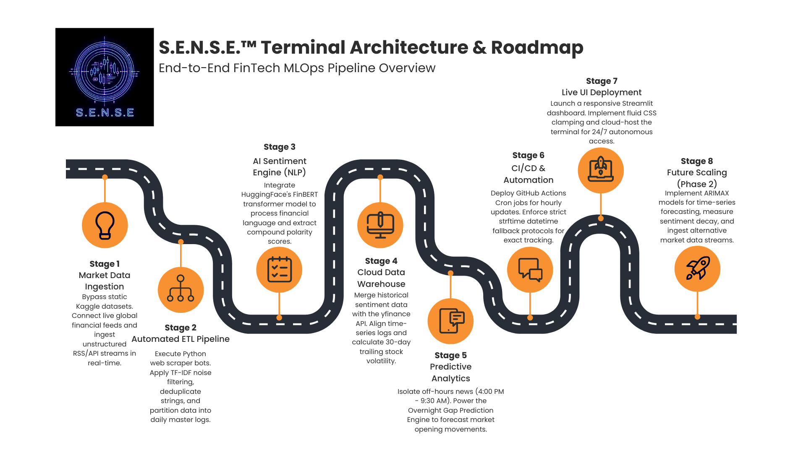

# 📈 S.E.N.S.E.™ Terminal (Sentiment Evaluation & News Scoring Engine)

**Live Autonomous Dashboard:** [Access the S.E.N.S.E.™ Terminal Here](https://stock-sentiment-tracker-bp9fsi9nsrbnww6li8kaze.streamlit.app/)

## 🎯 Project Overview
Static datasets are insufficient for analyzing live financial markets. S.E.N.S.E.™ is an automated, cloud-hosted MLOps pipeline and AI trading terminal built to ingest, score, and visualize market sentiment in real-time. 

Operating as a continuous CI/CD pipeline, this project replicates the quantitative news sentiment features of enterprise-grade market intelligence platforms (like RavenPack or AlphaSense) using a completely open-source, $0 infrastructure stack. It scrapes live data, processes unstructured text through a Transformer NLP model, and updates a public-facing executive dashboard autonomously.

## ⚙️ The Architecture & Data Flow
1. **Automated Ingestion (CI/CD):** Python-based web scraper bots run autonomously via GitHub Actions Cron jobs, extracting live global financial RSS feeds every hour.
2. **ETL & Data Partitioning:** Extracted data undergoes TF-IDF noise filtering, string deduplication, and is partitioned into pristine daily master logs.
3. **AI Sentiment Engine (NLP):** Cleaned headlines are processed through HuggingFace's **FinBERT** transformer model to extract compound polarity scores (Bullish/Bearish).
4. **Cloud Data Warehouse:** Automated Pandas workflows merge historical sentiment data with 30-day trailing stock volatility via the `yfinance` API.
5. **Predictive Analytics:** An overnight gap prediction engine isolates off-hours news (4:00 PM - 9:30 AM) to forecast the next day's opening price movement based on sentiment magnitude and historical volatility.
6. **Live UI Deployment:** A responsive Streamlit frontend continuously listens to the repository, updating the terminal instantly when new data compiles.

## 🛠️ Tech Stack
* **Language:** Python 3.10
* **Data Engineering:** Pandas, Glob, yfinance, RegEx
* **Machine Learning / NLP:** Transformers (HuggingFace), FinBERT, Scikit-Learn
* **Automation / MLOps:** GitHub Actions (CI/CD workflows)
* **Frontend / Visualization:** Streamlit, Plotly (Interactive Dual-Axis Charts), CSS Flexbox

## 🚀 Phase 2 Roadmap (Active Development)
A robust data pipeline is never truly finished. Immediate next steps for scaling the S.E.N.S.E.™ architecture include:
* **Advanced Time-Series Forecasting:** Transitioning from the current heuristic volatility model to a rigorous **ARIMAX** or **Facebook Prophet** time-series model.
* **Sentiment Decay & Exogenous Variables:** Utilizing the accumulated daily NLP sentiment scores as exogenous variables to train the ARIMAX model, measuring exactly how long a news catalyst impacts a stock's price before fading.
* **Alternative Data Streams:** Expanding the scraper bots to ingest real-time API streams for a wider market consensus.

---
**Engineered by Phanidhar Kasuba** *M.S. Data Analytics | Webster University (Class of 2025)* 
[Connect on LinkedIn](https://www.linkedin.com/in/phanidhar-kasuba/)
